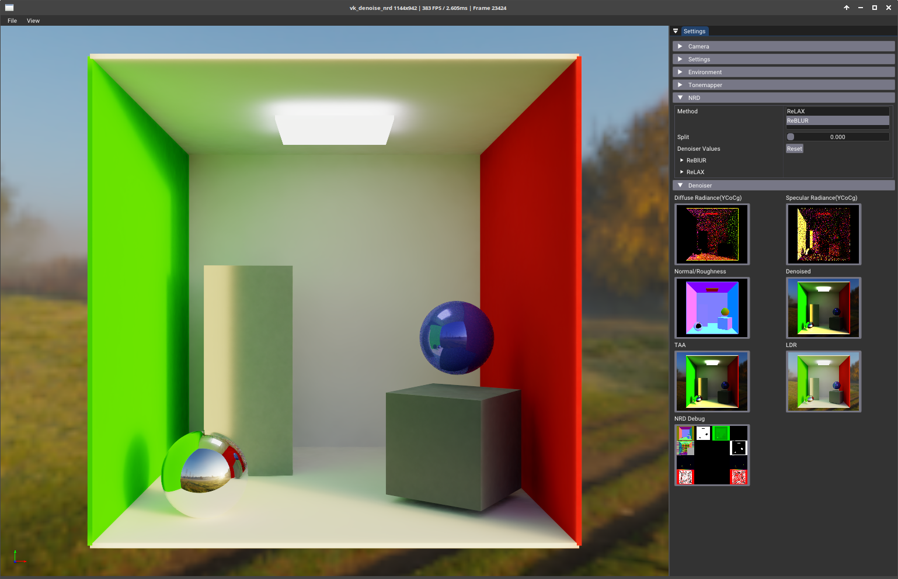
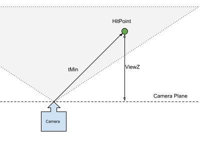

# Integration of NRD to an existing application
 


This example demonstrates [NRD, "NVIDIA Real-Time Denoisers",
](https://github.com/NVIDIAGameWorks/RayTracingDenoiser) in a simple path
tracer rendering a glTF scene. NRD is a spatio-temporal post-processing library
that removes noise from Monte-Carlo based path tracers. NRD is not just a single
denoiser, in fact it is a collection of specialized denoisers for specific
kinds of data, like diffuse and specular images, ambient occlusion, and shadow
data.

NRD itself provides a comprehensive sample at <https://github.com/NVIDIAGameWorks/NRDSample>,
showing all the bells and whistles of its various denoisers. This sample
instead focuses on an integration of the NRD library with a Vulkan renderer,
showing a simple pathtracer using NRD to denoise the rendered image.

More Resources:
* Get more information at: <https://developer.nvidia.com/nvidia-rt-denoiser>
* NRD Sample: <https://github.com/NVIDIAGameWorks/NRDSample>
* NRD SDK: <https://github.com/NVIDIAGameWorks/RayTracingDenoiser>

## Building 

You need the [nvpro_core](https://github.com/nvpro-samples/nvpro_core)
repository checked out next to the vk_denoise_nrd sample. At configuration time
CMake will look for the nvpro_core repo and include it into the build. Follow
the general CMake process to configure and build the sample.

This project needs the NRD SDK. CMake for the sample project is configured to
automatically download the latest version of NRD from
<https://github.com/NVIDIAGameWorks/RayTracingDenoiser>.

## NRD Denoising Methods

NRD offers these denoising methods:

* [ReBLUR](https://developer.nvidia.com/nvidia-rt-denoiser#REBLUR): Blur the information over multiple frames; good for low samples per pixel.
* [ReLAX](https://developer.nvidia.com/nvidia-rt-denoiser#RELAX): Preserves lighting details better.
* [SIGMA](https://developer.nvidia.com/nvidia-rt-denoiser#SIGMA): Works on all kinds of shadows.

In our sample, we test ReBLUR and ReLAX.


## CMake Integration of NRD

The NRD SDK comes with direct CMake support. In this sample we use the
'FetchContent' CMake module to automatically download and express a dependency
on the NRD SDK:

```cmake
# CMake module FetchContent
include(FetchContent)

# Tell CMake where to find NRDSDK, how to get it and where to place it locally.
# CMake will automatically look for CMakeLists.txt in there
FetchContent_Declare(
    NRDSDK
    GIT_REPOSITORY https://github.com/NVIDIAGameWorks/RayTracingDenoiser.git
    GIT_SHALLOW
    GIT_SUBMODULES
    SOURCE_DIR ${CMAKE_CURRENT_SOURCE_DIR}/externals/nrd
)

# Configure the NRD build to only produce SPIR-V binaries and embed them into the NRD library
option (NRD_EMBEDS_DXIL_SHADERS "NRD embeds DXIL shaders" OFF)
option (NRD_EMBEDS_DXBC_SHADERS "NRD embeds DXBC shaders" OFF)
set(NRD_EMBEDS_DXIL_SHADERS OFF)
set(NRD_EMBEDS_DXBC_SHADERS OFF)

# Cause CMake to download and/or update our local copy of NRDSDK.
FetchContent_MakeAvailable(NRDSDK)

# Make our project link with NRD
target_link_libraries(${PROJECT_NAME} NRD)
```

The only NRD compile time options we set in this sample are
`NRD_EMBEDS_DXIL_SHADERS` and `NRD_EMBEDS_DXBC_SHADERS` to disable building
these shader binaries. Refer to [externals/nrd/CMakeLists.txt](externals/nrd/CMakeLists.txt) for a list of
supported options, such as normal and roughness encoding. Our sample leaves
this at default (i.e. linear roughness and RGB10A2 normal encoding).

At CMake configuration time, NRD also creates a shader include file
'nrd/Shaders/Include/NRDEncoding.hlsli' that will be used to communicate the
chosen normal and roughness encoding to the user's shaders.

## Integration of NRD

NRD itself is platform-agnostic and thus can be used with DirectX and Vulkan.
Its internal compute shaders are written in HLSL and typically compiled as part
of the NRD SDK compilation process.

There are several ways to integrate NRD.
* As a 'white-box library': the application is asked to do everything, including
  allocating needed resources AND compiling NRD's shaders
* As a 'black-box library': the application creates all resources, but the
  shaders will be handed to the application as precompiled binary blobs
  (SPIR-V, DXIL, etc)
* Via NRD's integration layer: NRD SDK provides an integration wrapper based
  on [NRI (NVIDIA Render Interface)](https://github.com/NVIDIAGameWorks/NRI)

In this sample we chose the 'black-box library' approach, using a thin wrapper
around NRD that handles the integration of NRD with Vulkan.


### NRD and GLSL

Even though the the NRD-internal shaders are all precompiled, a few shader
fragments will be needed in the user's shaders to encode data in a way NRD
requires. NRD is naturally written in HLSL, but can be instructed to emit
GLSL-compatible syntax. We achieve this by defining `NRD_GLSL 1` at the top of
`nrd.glsl` before including `nrd.hlsli`

NRD build is using a SPIR-V-enabled DirectX shader compiler "dxc" to
compile its HLSL shaders into SPIR-V that Vulkan can digest. dxc comes with the
Vulkan SDK, which can be downloaded [here](https://vulkan.lunarg.com/sdk/home).
Another option is to download
[https://github.com/microsoft/DirectXShaderCompiler](https://github.com/microsoft/DirectXShaderCompiler)
and build it from source.

If NRD can't find dxc at CMake configuration time, consider providing CMake
with `-DNRD_DXC_CUSTOM_PATH=<custom/path/to/dxc>` to point it to the dxc
executable directly.

### NRDWrapper

The NRD SDK comes with example code to integrate NRD with NRI (NVIDIA Render
Interface). However, vk_denoise_nrd is targeted at integration of NRD with
Vulkan specifically, utilizing
[nvpro_core's](https://github.com/nvpro-samples/nvpro_core) helper classes.

NRD calls this integration variant _black-box library integration._ A small
wrapper class, `NRDWrapper`, contains all the necessary code for that. Since
NRD is graphics API agnostic (supporting D3D and Vulkan), it describes
required resources in an API independent manner. NRDWrapper hides the
complexities of interpreting these descriptions and creating all resources
(buffers, textures) that NRD needs. The wrapper also interprets NRD's
description of how to perform the denoising pipeline and translates this into
executing a series of compute shader invocations with proper pipeline barriers
in-between the passes. Code comments in NRDWrapper.cpp/.hpp describe the details
of its API and implementation. Additionally, one can find a lot of information
in the NRD headers themselves. Notably, `NRDDesc.h` and `NRD.hlsli` are worth
looking into to understand the various NRD inputs and outputs as well as
learning about what resource types are needed for each type of denoiser.

NRDWrapper creates all NRD-internal textures on its own, with the the exception of
the "user texture pool". This is a pool of textures that both NRD and the application
operate on. NRD calls these "resources". The user texture pool array may be sparsely
populated, depending on the used denoiser. Consult `NRDDescs.h` to see which denoisers
require which types of resource (i.e. texture) and what format each resource needs
to have.

This sample focuses on using the `REBLUR_DIFFUSE_SPECULAR` and
`RELAX_DIFFUSE_SPECULAR` denoisers, which each take separate noisy
diffuse+hitdistance and specular+hitdistance buffers as input.

## The path tracing pipeline

1. The primary driver of the rendering is the `nrd.rgen` ray generation shader.
   It'll cast the primary as well as all secondary ray segments.
   This approach is preferred as it keeps the required "stack memory"
   lower than recursively casting rays from closest-hit shaders.
   
2. The first step for each ray is to find the first non-mirrored surface, the _primary hit_.
   At the primary hit we record all material properties (such as normals) that NRD needs and write
   them into the appropriate buffers. If we did not hit anything, the ray missed all
   geometry and thus will be recorded as hitting the skybox only. Mirrored surfaces
   need special treatment ([PSR](#mirror-like-surfaces), described below).
   
3. Find direct lighting contributions. For this, we loop through
   all lights, tracing a shadow ray for each. If the light is visible, we add its
   contribution to the direct lighting. We also add the primary hit's material
   light emission here. The direct light contributions are not noisy and thus
   are written into a separate buffer which does not undergo denoising.
   It will later be added back to the scene during compositing.

4. Probe the environment map lighting at the primary hit. The environment map
   has been preprocessed to provide a PDF and a randomized sampling pattern
   according to that PDF, emphasizing sampling density around its bright spots. A
   shadow ray tests if the primary hitposition is actually visible to the
   environment map in the chosen direction. Since this sampling is randomized, we
   later add its diffuse and specular environment map contribution to the noisy
   diffuse and specular output images for the denoiser to deal with. Environment
   map contributions via direct and indirect probing need to be carefully
   weighted; see the [MIS weighting](#mis-weighting) section.

5. From the hit position we perform path tracing to collect the incoming indirect light -
   once along the material's diffuse BSDF, and once along its specular BSDF.
   For this tracing we use the pathtrace.rchit shader. At each hit position we do the following:
    - If the ray missed all geometry, we hit the environment map. Return its light contribution,
      multiply it by a [MIS weight](#mis-weighting), and report the end of this ray via `payload.hitT = NRD_INF`.
    - When hitting geometry, collect direct lighting contributions just as we did for the primary ray
      (lights, envmap - see above).
    - Sample the material's BSDF for a suggested direction to follow for the next path segment.
    - In case of an absorption event, return `payload.hitT = NRD_INF` to end the path here.
    - Otherwise, return a new ray segment (origin, direction and PDF value for the direction) and
      the light contribution at the current hit position to `nrd.rgen`, which continues to accumulate
      the light along the path.
    - Repeat tracing paths until the ray ends or reaches the maximum number of bounces.
      Pass the distance from the primary hit to the subsequent hit to NRD.
    
6. De-modulate diffuse and specular color and store them encoded for the denoiser. Also store enough information
   to recompute the [(de)modulation values](#demodulation) in the composition shader.


## NRD Details

As mentioned above, in this sample, we're making use of two denoisers:
`REBLUR_DIFFUSE_SPECULAR` and `RELAX_DIFFUSE_SPECULAR`.

According to NRDDescs.h, `REBLUR_DIFFUSE_SPECULAR` needs the following inputs:

* `IN_DIFF_RADIANCE_HITDIST`: a texture containing the 'demodulated' diffuse radiance at the primary hit point as well as the distance to the second hit (following the diffuse BSDF)
* `IN_SPEC_RADIANCE_HITDIST`: a texture containing the 'demodulated' specular radiance at the primary hit point as well as the distance to the second hit (folloing the specular BSDF)
* `MOTION`: a texture with 3D vectors of the previous pixel 3D position to the new position. The motion vectors can be set to 0, and set `isMotionVectorInWorldSpace` to true. This will do an approximation of the motion vectors without the need to provide them. This is what we have done.
* `NORMAL_ROUGHNESS`: Normal, material roughness, and material ID packed into a 4D vector. The normal vector should be between [-1..1] and roughness in linear space. See the function `NRD_FrontEnd_PackNormalAndRoughness()` to see how this is done.
* `VIEWZ`: This is the linear depth of the hit position in camera space. For example, `float z = (worldToView * hitPosition).z` yields the desired value.
* It also takes a couple of optional inputs that this sample does not provide for simplicity's sake.



These are its output textures:
 * `OUT_DIFF_RADIANCE_HITDIST` - a texture containing the denoised diffuse image
 * `OUT_SPEC_RADIANCE_HITDIST` - a texture containing the denoised specular image

The denoiser `RELAX_DIFFUSE_SPECULAR` takes the same inputs, which makes it
easier to switch between the two.

Consult NRDDescs.h to see which inputs are required. For each input type
("Resource Type") it also prescribes the required image format and other
dependencies.

NRD can only work, if it is provided with the right data. NRD's [README.md](https://github.com/NVIDIAGameWorks/RayTracingDenoiser/blob/master/README.md)
talks about this in much detail. Below we will mention a few critical points to
get right.


### Splitting diffuse and specular signals

NRD can be made work with combined diffuse and specular lighting in one
channel, but to improve denoising quality, it's better to separate out these two
noisy signals at the primary hit (or PSR as shown later).


Splitting the path traced image into a diffuse and specular image requires
separately following the diffuse and specular material's BSDF at the position
of the first non-mirrored hit. This sample chooses to produce each signal's
image at full resolution, which also means we're doubling the amount of rays
per pixel. Other approaches may used as well:

  * a checkerboard pattern where every other pixel position follows either a diffuse or specular path.
  * a probabilistic approach where following either a diffuse or specular path is a random choice.

There are certain requirements to make sure, diffuse and specular samples do
exist in a specific neighborhood around each pixel. Follow the NRD README.md
file for more details.

The secondary paths to compute the indirect radiance coming from the diffuse
BSDF's and specular BSDF's direction will then be performed in a regular
fashion (i.e. after the first bounce, both kinds of light path sample the full BSDF).
This is expressed in `shaders/nrd.rgen` marked with `#DIFFUSE` and
`#SPECULAR`. The path tracing code for gathering the indirect light contributions
can be found in `pathtrace.rchit`.

### Hit distances

NRD asks for a scalar 'hit distance' to be provided. This is typically the
path length along the ray between the primary hit (or PSR) and the next hit.
Hit distances can also be extended to accumulate along the path, but this
requires special handling (refer to NRD's [README.md](https://github.com/NVIDIAGameWorks/RayTracingDenoiser/blob/master/README.md)).
In this example, we chose the easier method of just using the secondary path
length.

Specific hit distances are used under these circumstances:

* if the ray is absorbed at the primary hit, we return a hit distance of 0.0.
* if the secondary ray hits the environment, we return a hit distance of `NRD_INF`.


### Mirror-like surfaces

Mirror-like surfaces work better with a special treatment. Instead of recording
the position and hit parameters at the surface of the mirror, we continue
following the mirrored ray until it hits something that is not a mirror - the
_Primary Surface Replacement (PSR)_. It looks like as if we can see the
mirrored objects "behind" the mirror as though the mirror acts as kind of a
portal into a virtual world. The G-Buffer records the data of the PSR at its
virtual world space, such as Normal, Roughness and ViewZ. This helps the denoiser
denoise reflected objects much better.

Look into `shaders/nrd.rgen` for `#PSR` to find the shader code that implements
primary surface replacement and consult NRD SDK's README.md for more details.

### Demodulation

Demodulation is the act of removing _intended_ 'noise' from the image before we
present it to the denoiser. These kinds of intended noise are typically details
coming from textures at the primary hit surface; for instance, grain in a wood texture. You certainly don't want the
denoiser recognizing these details as noise to remove. This would result in
blurry, less detailed surfaces after denoising. In addition, we completely
separate out noise-free signals like:

* light emissions of the primary surface;
* perfect reflections of the environment map;
* when the primary ray does not hit any geometry but instead hits the
  environment map directly.

We follow NRD's README.md's suggestion for demodulating the diffuse and
specular signals in `nrd.rgen`.

The `composition.comp` shader will later multiply the denoised diffuse and
specular images by the inverse of the modulation factor and recombine all
parts of the image (specular, diffuse, direct light) into a single one.

### MIS weighting

The implemented path tracer uses importance sampling to estimate the
integral in the [rendering equation](https://en.wikipedia.org/wiki/Rendering_equation).
Care has to be taken when the
path tracer samples the same function multiple times, but uses different PDFs
when doing so. This sample is built such that, at the primary hit and each
segment of the indirect path, we sample the environment map for its direct
light contribution at that point. It then follows the material's BSDF to probe
for indirect lighting contribution at the hit point. Thus, for any surface
point along the path it can happen that the environment is sampled twice: once
via directly probing the environment map (the envmap has its own precomputed
sampling distribution) and once more when following the material's BSDF at each
hit point. Both contributions need to be weighted accordingly. In this sample
we chose the "power heuristic" to compute the MIS weights for both
contributions.


## Compositing

The final image will be composed of the denoised diffuse and specular color plus
direct lighting. Diffuse and specular are added only if there
was a hit and albedo is extracted from the base color and metalness information.


```glsl
  vec3 R = vec3(directLighting);
  if(wasHit)
  {
    R += indirectDiff;
    R += indirectSpec;
  }
```


## Authors and Metadata

Tags:

- raytracing, path-tracing, GLTF, HDR, tonemapper, picking, BLAS, TLAS, PBR
material, denoising, NRD

Extensions:

- VK_KHR_buffer_device_address, VK_KHR_acceleration_structure,VK_KHR_ray_tracing_pipeline, 
VK_KHR_ray_query, VK_KHR_push_descriptor, VK_KHR_shader_clock, VK_KHR_create_renderpass2

Authors:
- [Martin-Karl Lefrançois](https://developer.nvidia.com/blog/author/mlefrancois/)
- Mathias Heyer
