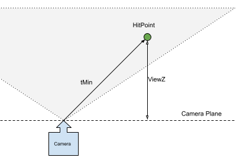
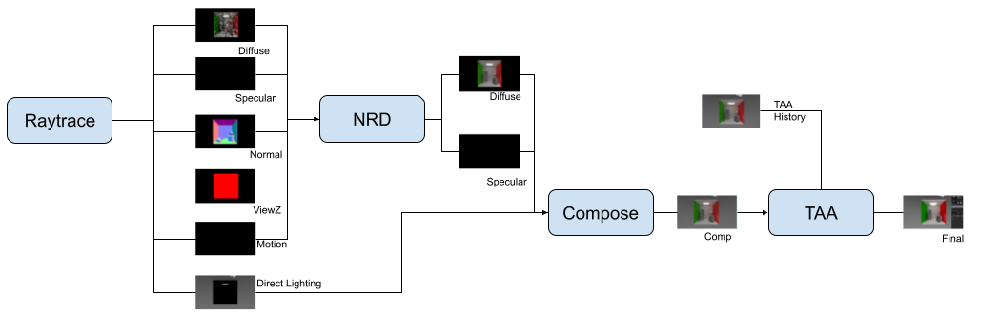
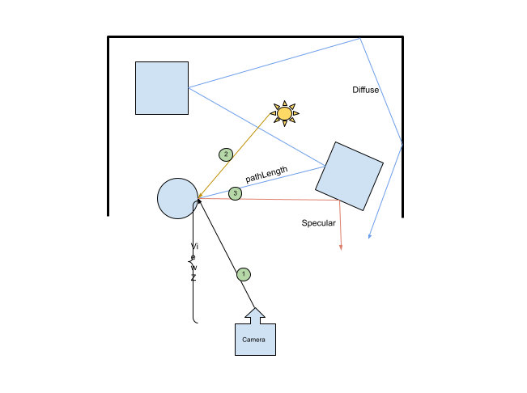
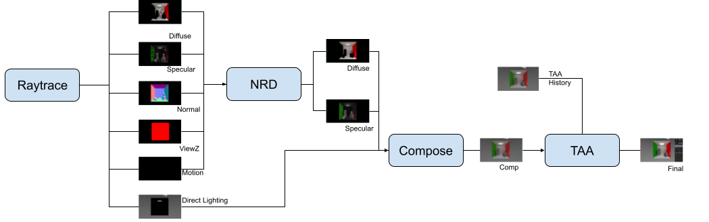

# Integration of NRD to an existing application

## What is NRD

NRD stands for NVIDIA real-time denoiser. It is a spatio-temporal post-processing that removes noise from Monte-Carlo based path tracers.

* Get more information under: <https://developer.nvidia.com/nvidia-rt-denoiser>
* GitHub(public):<https://github.com/NVIDIAGameWorks/NRDSample>
* GitHub(private): <https://github.com/NVIDIAGameWorks/RayTracingDenoiser>

## Which Methods

There are three methods:

* [ReBLUR](https://developer.nvidia.com/nvidia-rt-denoiser#REBLUR): Blur the information over multiple frames.
* [ReLAX](https://developer.nvidia.com/nvidia-rt-denoiser#RELAX): Better preserving the lighting.
* [SIGMA](https://developer.nvidia.com/nvidia-rt-denoiser#SIGMA): Works on all kind of shadows

In our test, we are testing ReBLUR and ReLAX.

## Integration of NRD

There are several ways to integrate NRD. First of all, NRD has no Vulkan, OpenGL or DirectX code. It has several compute shaders written in HLSL, a Makefile for different targets, such as Spir-V and some headers.

When initializing the NRD, it creates internally what would be needed for the requested technique. This can be seen as a recipe for denoising. Resource allocation and invocation of compute shaders are left to the application.

The NRD SDK is also provided with an integration header. This performs the intermediate resource allocation (several textures and samplers), creates the different pipelines and, when calling denoise(), invokes the compute shaders in the order specified by NRD. This is done using NRI (NVIDIA Rendering Interface), a lightweight interface on DirectX 11 and 12, and Vulkan.

You don't need to use NRI, the interface is quite simple and someone could replace it with its native API. In this integration we used the NRI and NRD black box, which means that the shaders are compiled in a DLL and not compiled by the sample. This choice was made to simplify the integration of future versions of NRD and minimize the integration effort.

## NRD Inputs

Each method requires a number of entries. You can find the complete list of entries in the NRD.h header. Not all inputs are required and you can see which ones are required by the denoising method. All these entries are textures of different formats that the application has to create. They all have to be the size of the output render image.  

This is the list of minimum inputs for ReBLUR

* **MOTION**: 3D vector of the previous pixel 3D position to the new position. The motion vectors can be set to 0, and set `isMotionVectorInWorldSpace` to true. This will do an approximation of the motion vectors without the need to provide them. This is what we have done.
* **NORMAL_ROUGHNESS**: A pack normal and material roughness in a 4d vector. The normal vector should be between [0..1] and roughness in linear space. See the function `PackNormalAndRoughness()` to see how this is done.
* **VIEWZ**: This is the 3D position in camera space (positive). With the hit position, you can do: `float z = abs((worldToView * hitPosition).z)` to get the expected value.
* **DIFFUSE**: The diffuse contribution at hit point. See next section for details
* **SPECULAR**: The specular contribution at hit point. See next section for details

ViewZ
 

## NRD Outputs

From the inputs the denoiser will generate two outputs:

* **DIFFUSE**: The diffuse contribution denoised
* **SPECULAR**: The specular contribution denoised

Those will be used to display the final image.

## G-Buffers

Many textures will have to be created, all the NRD inputs and outputs, but also some additional textures for the final compositing. For example, we will also need :

* **BASECOLOR_METALNESS**: The base color of the material and its level of metalness.
* **DIRECT_LIGHTING**: the sky, the emissive material, and also the direct lighting of material.

## Simplest Solution

The easiest way to user the NRD denoiser with our path tracer is to use `RELAX_DIFFUSE_SPECULAR`. Without giving perfect results, the method simplifies what needs to be done. Basically, the minimum required is to fill the normal_roughness and viewZ. The result of the path tracer goes to diffuse and specular is set to 0, except for the path length. 

See the implementation in [`shaders\pathtrace.rgen`](shaders\pathtrace.rgen)




## Enhance Solution

To get better results, it is recommended to split the diffuse and specular contribution. 




1. We first trace a ray to get the G-Buffer information. For this, we have a different closest-hit shader that returns all the information we need: hit distance, normal, roughness, metalness, base color, emissive color.
2. Secondly, we get the direct light contributions. For this, we loop through all lights, trace a shadow ray. If the light is visible we add this contribution to the direct lighting, which already contains the emissive contribution.
3. From the hit position we will path trace, once for diffuse, once for specular.
    1. Find a sample direction for diffuse or specular and evaluate the contribution for the outgoing ray.
    1. Paths Trace until ray dies and take the first bounce path length.
    1. Add the contribution to either the diffuse or specular.
4. Loop back to 3 if there are many samples per pixel
5. Store the diffuse and specular.



## Compositing

The final image will be composed of the denoised diffuse and specular, plus  Direct_Ligthing and base color. Diffuse and specular are added only if there was a hit and albedo is extracted from the base color - metalness information.

```C++
  vec3 R = vec3(directLighting);
  if(wasHit)
  {
    R += indirectDiff;
    R += indirectSpec;
  }
```

## Temporal Anti-Aliasing

To remove the jaggy edges, a temporal anti-aliasing is helping. The one which is implemented is fairly simple and comes from [this example](https://www.shadertoy.com/view/tsjfRh).